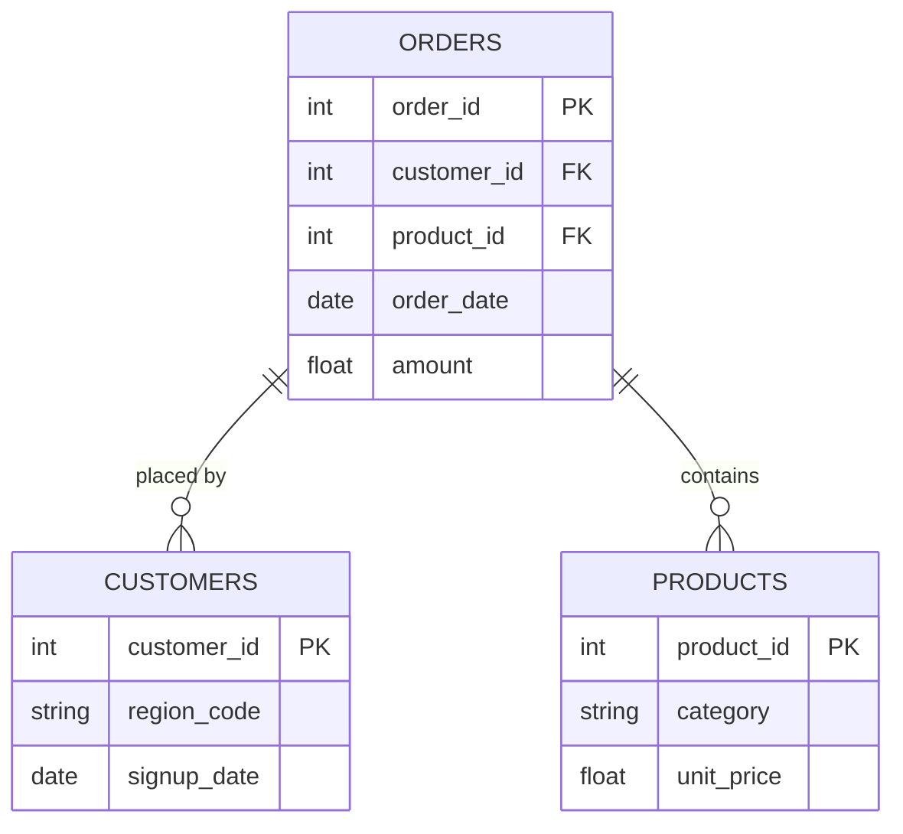

# Coffee Consumer Intelligence Dashboard

---

## ⚙️ Project Type Flags

-  Exploratory Data Analysis (EDA)
- [ ] SQL Analysis / Querying
-  Dashboard / Data Visualization
-  Data Pipeline / ETL
- [ ] Predictive Modelling / Machine Learning
-  Data Cleaning / Wrangling
- [ ] End-to-End (multiple of the above)
- [ ] Other: ___________

---

## Table of Contents
1. [Project Overview](#1-project-overview)
2. [Objectives](#2-objectives)
3. [Project Scope & Tools](#3-project-scope--tools)
4. [Repository Structure](#4-repository-structure)
5. [Data Workflow](#5-data-workflow)
6. [Data Model & Schema](#6-data-model--schema)
7. [ERD - Entity Relationship Diagram](#7-erd--entity-relationship-diagram) *(SQL projects)*
8. [Analysis & Metrics](#8-analysis--metrics)
9. [Key Insights](#9-key-insights)
10. [Recommendations](#10-recommendations)
11. [Assumptions & Limitations](#11-assumptions--limitations)
12. [Future Enhancements](#12-future-enhancements)
13. [Deliverables](#13-deliverables)
14. [Author](#14-author)

---

## 1. Project Overview


**Context:** Coffee has evolved beyond a daily beverage into a lifestyle product shaped by consumer preferences, purchasing behaviour, brewing habits, and perceived value. As the specialty coffee industry becomes increasingly, competitive, business require more than just sales report - they need actionable consumer intelligence to understand what drives preferences, spending, and long-term engagement.
The Coffee Consumer Intelligence Dashboard was developed to transform more than 4000 coffee taste survey responses into an executive decision-support solution. Rather than presenting descriptive statistics alone, the dashboard identifies the behavioural patterns that influence coffee consumption and purchasing decisions. Interactive filtering enables stakeholders to explore trends across different consumer segments with dynamic KPIs and narrative insights provide immediate interpretation of the findings.

**Problem Statement:** Coffee businesses collect significant amounts of consumer feedback through surveys and testing events. However, this information often exits in isolated datasets that provide limited business value without structured analysis.
As a result, stakeholders struggle to answer strategic questions such as;
-  Which coffee characteristics drive consumer preference?
-  Which brewing methods dominate current consumer preference?
-  How much are consumers willing to spend on coffee and brewing equipment?
-  Do blind taste results align with stated coffee preferences?
-  Which demographic groups represent the highest-value customer segments?

**Approach:** A structured Business Intelligence methodology was adopted to transform raw survey responses into actionable insights. Rather than focusing solely on visualization, the project followed a systematic analytical process that aligned business objectives with technical implementation. Processes such as, business understanding, data understanding, data preparation, data modelling, Exploratory Data Analysis (EDA), KPI development, dashboard development, business insight generation, and strategic recommendation development.
This structured methodology ensured that the project progressed logically from business understanding to actionable recommendations, resulting in an analytical solution that is both technically robust and strategically relevant.

**Outcome:** The completed dashboard delivers a centralized executive reporting solution that transforms complex survey data into clear, interactive, and actionable business insights. By integrating consumer preferences, blind taste evaluations, spending behaviour, and demographic segmentation into a single analytical platform, the solution enables stakeholders to quickly identify emerging trends, evaluate consumer value perception, and make informed strategic decisions based on data rather than assumptions.

---

## 2. Objectives


The primary objective of this project is to deliver an executive dashboard that converts survey responses into meaningful business insights for decision-makers. Also, the project aims to:
- Analyze consumer coffee preferences across coffee styles, roast levels, brewing methods, strength, and caffeine choices.
- Evaluate blind taste test outcomes to identify products with the strongest sensory appeal.
- Examine consumer purchasing behaviour, spending patterns, and willingness to pay.
- Understand how demographics influence coffee preferences and purchasing decision.
- Measure consumer perceptions of cafe experiences and home brewing equipment.
- Build an interactive dashboard that enables executive to monitor key consumer trends through dynamic filtering and visualization.
- Deliver actionable recommendations that support product development, pricing strategies, and customer engagement initiatives.


---

## 3. Project Scope & Tools

### Scope


| Dimension | Details |
|-----------|---------|
| **In Scope** |  Consumer demographic analysis, coffee consumption frequency and drinking locations, coffee style, roast level, strength, and caffeine preferences.  Brewing method analysis, consumer motivations for drinking coffee, spending behaviour and willingness to pay.  Coffee equipment spending and perceived equipment value.  Cafe value perception.  Blind taste test evaluation, including preference, bitterness, and acidity analysis, customer segmentation based on demographic and behavioural attributes, interactive Power BI dashboard development, and business insight generation and strategic recommendations. |
| **Out of Scope** | The dataset does not support the following analyses and they are intentionally excluded from the project:  Sales revenue analysis, profitability analysis, inventory management, customer lifetime value analysis, geographic sales performance, market share analysis, seasonal or time-series trend analysis, predictive forecasting, and customer churn analysis. |

### Tools & Technologies


| Category | Tool(s) Used |
|----------|-------------|
| Data Storage | CSV files |
| Data Processing | Excel, Power Query |
| Analysis | DAX |
| Visualization | Power BI |
| Version Control | Git / GitHub |
| Documentation | Markdown |

---

## 4. Repository Structure

```
[project-root]/
│
├── data/
│   ├── raw/                  # Original, unmodified source data - never edited
│   ├── processed/            # Cleaned and transformed data
│   └── external/             # Reference data, lookup tables, third-party files
│
├── notebooks/                # Jupyter, R Markdown, or Colab notebooks
│
├── scripts/                  # Reusable .py, .R, or .sh processing files
│
├── queries/                  # SQL files (retain this folder for SQL-heavy projects)
│   ├── exploratory/          # Ad-hoc or investigative queries
│   ├── transformations/      # Cleaning and reshaping logic
│   └── final/                # Production-ready or presentation queries
│
├── reports/                  # Final outputs: PDFs, slide decks, Word docs
│
├── visuals/                  # Exported charts, dashboard screenshots, ERD diagrams
│
├── docs/                     # Data dictionaries, schema notes, reference material
│
├── project_metadata.yml      # Machine-readable metadata (optional)
└── README.md                 # You are here
```

> ⚠️ *Delete folders you didn't use. An empty folder is worse than no folder.*
> SQL-heavy projects: keep `queries/`. Analysis-only projects: keep `notebooks/`. Both? Keep both.

---

## 5. Data Workflow

```
[Data Source(s)]
      ↓
[Ingestion / Collection Method]
      ↓
[Cleaning & Transformation]
      ↓
[Analysis / Modelling / Querying]
      ↓
[Output / Visualisation / Reporting]
```

1. **Source:** The dataset contains a CSV file, which is a Coffee Taste testing survey dataset consisting of over 4,000 responses and 57 attributes, covering consumer demographics, coffee preferences, purchasing behaviour, blind taste evaluations, and spending patterns.
2. **Ingestion:** Loaded into Power Query. File contained approx. 4,042 rows and 57 columns.
3. **Cleaning:** Several data quality improvements were performed to ensure reliable analysis and accurate reporting, such as; data type validation, handling of missing values (such as NA, Blank, Other), standardizing categories, and removing redundancies (such as, '_other, _specify' columns). 
4. **Transformation:** Several analytical fields were created to improve reporting capabilities and enable meaningful business metrics. These fields include; Numeric spending columns - survey spending categories were originally stored as text ranges ($20-$40, $40-$60, etc.). These categories were converted into representative midpoint values to support numerical calculations such as; average monthly spend, average equipment spend, average price paid, and average willingness to pay. Cafe Value Rate originally came in as a binary Yes/No field and was transformed into a measurable KPI representing the percentage of respondents who believe cafe purchases provide good value. Same approach was applied to Equipment Value Rate. Finally, Blind Taste Comparison dataset contained two separate preference columns (preferred_abc and preferred_ad), but to support comparative analysis, these columns were unpivoted into two new fields (comparison - Blind tasting scenario, and Preferred Coffee - winning coffee selection), this transformation enabled the construction of the 100% Stacked Bar Chart that dynamically compares consumer preferences across blind tasting scenarios. 
6. **Analysis:** Descriptive statistics, Blind taste comparative analysis, Average monthly spend value, Average equipment spend value, Cafe value rating, Equipment value rating, Preferred coffee analysis, Brewing method analysis, Preferred roast level analysis, Preferred strength analysis, Coffee style preference analysis, etc.
7. **Output:** Summary report in PDF

---

## 6. Data Model & Schema

<!--
  Define your fields so that someone reading your analysis can follow along
  without digging through your code.

  WHAT GOOD LOOKS LIKE (one row example):
  | transaction_id | string | Unique identifier per sales transaction | TXN-00482 |
  | return_flag    | boolean | Whether the transaction included a return | TRUE |
  | region_code    | string | Two-letter identifier for store region | "NE" |

  WHAT TO AVOID:
  ❌ Skipping this section because "the field names are self-explanatory."
     They're not. Not to a reviewer. Not to you in six months.

  📌 FOR SQL PROJECTS: If you have multiple tables, create one block per table.
     Describe join keys and relationships here. Your ERD (Section 7) will
     visualise what this section describes in text.

  📌 FOR NON-SQL PROJECTS: Describe the shape of your dataset informally
     if a formal schema doesn't apply. Even one paragraph is more helpful than nothing.
-->

### Dataset / Table: `[name]`

| Field Name | Data Type | Description | Example Value |
|------------|-----------|-------------|---------------|
| `[field_1]` | [string / int / date / float / boolean] | [What this field represents] | [Non-sensitive example] |
| `[field_2]` | [string / int / date / float / boolean] | [What this field represents] | [Non-sensitive example] |
| `[field_3]` | [string / int / date / float / boolean] | [What this field represents] | [Non-sensitive example] |

> **Row count (approx.):** [X rows]
> **Date range:** [Start] – [End]
> **Key join / relationship:** [e.g., `orders.customer_id` → `customers.id`]

*Add additional table blocks as needed for multi-table projects.*

---

## 7. ERD - Entity Relationship Diagram
### *(Primarily for SQL Projects - remove this section if not applicable)*

<!--
  An ERD shows how your tables connect to each other visually.
  It is the fastest way for a reviewer to understand the data structure
  of a SQL project without reading every query.

  HOW TO INCLUDE YOUR ERD:
  Option A - Image embed (most common):
    Export your ERD from dbdiagram.io, DBeaver, Lucidchart, or similar.
    Save to /visuals/erd.png and reference it below.

  Option B - dbdiagram.io code block (version-controllable):
    Paste your schema definition code directly in the fenced block below.
    Anyone can paste it into dbdiagram.io to regenerate the visual.

  Option C - Mermaid diagram (renders natively in GitHub):
    Use the mermaid code block syntax below.
    GitHub will render this as a diagram automatically.

  PICK ONE. Don't use all three. Delete the options you don't use.
-->

### Option A - Embedded Image

*[Brief caption: e.g., "Three-table schema - orders, customers, and products joined on shared IDs."]*

---

### Option B - dbdiagram.io Schema Definition
```
Table orders {
  order_id    int     [pk]
  customer_id int     [ref: > customers.customer_id]
  product_id  int     [ref: > products.product_id]
  order_date  date
  amount      float
}

Table customers {
  customer_id int  [pk]
  region_code string
  signup_date date
}

Table products {
  product_id   int    [pk]
  category     string
  unit_price   float
}
```
*Paste this into [dbdiagram.io](https://dbdiagram.io) to view the visual.*

---

### Option C - Mermaid Diagram *(renders on GitHub)*


---

**Table Relationships Summary:**

| Relationship | Join Key | Type |
|-------------|----------|------|
| `orders` → `customers` | `customer_id` | Many-to-One |
| `orders` → `products` | `product_id` | Many-to-One |
| [Add rows as needed] | | |

---

## 8. Analysis & Metrics

<!--
  Explain what you measured and how - before you share what you found.

  WHAT GOOD LOOKS LIKE:
  Metric: "Customer Return Rate"
  Definition: "Number of transactions flagged as returns divided by total
               transactions, calculated at product-category and regional grain."
  Why It Matters: "Return rate - not sales volume - was hypothesised to
                  explain regional revenue gaps. This metric tests that hypothesis."

  WHAT TO AVOID:
  ❌ Defining a metric only in code: SUM(returns) / COUNT(transaction_id)
     That's an implementation. Write the plain-language definition here.
     Both belong in your project - the definition in the README,
     the implementation in the code.
-->

### Analytical Approach

The project followed a structured Business Intelligence workflow designed to transform raw survey responses into actionable insights. The analytical process consisted of six key stages: Business understanding, Data preparation, Data modelling, Feature engineering, Data visualization, and Business insight generation. The findings were translated into practical recommendations to support product strategy, pricing decisions, and customer engagement.

### Key Metrics Defined

| Metric | Plain-Language Definition | Why It Matters |
|--------|--------------------------|----------------|
| `Total Respondents` | Total number of survey participants included in the analysis. | indicates survey coverage and confidence in the findings |
| `[Metric 2]` | [What it measures, in one sentence] | [What decision or question it answers] |
| `[Metric 3]` | [What it measures, in one sentence] | [What decision or question it answers] |

### Methods Used

- [e.g., Descriptive statistics - distribution, central tendency, outlier detection]
- [e.g., Trend analysis across [time period]]
- [e.g., Segmentation / group comparison by [dimension]]
- [e.g., Correlation analysis between [variable A] and [variable B]]
- [e.g., SQL window functions for [specific aggregation]]
- [e.g., Custom aggregation or transformation logic in [tool]]

---

## 9. Key Insights

<!--
  Findings + implications. Not just what happened - what it means.

  WHAT GOOD LOOKS LIKE:
  ✅ "Return rates, not sales volume, explain Region A's underperformance.
      Region A's return rate on home goods was 34% - more than double the
      company average. Revenue was not lost at the point of sale; it was
      lost post-sale through refunds. This points to a fulfilment or
      product quality issue specific to that region, not a demand problem."

  WHAT TO AVOID:
  ❌ "Region A had lower revenue than other regions in Q4."
     (That's an observation. It describes what happened.
      An insight says what it means and where to look next.)

  Aim for 3–6 insights. Quality over quantity.
-->

**Insight 1: [Short descriptive headline]**
[What you found + what it suggests. One short paragraph.]

**Insight 2: [Short descriptive headline]**
[What you found + what it suggests.]

**Insight 3: [Short descriptive headline]**
[What you found + what it suggests.]

**Insight 4 (if applicable): [Short descriptive headline]**
[What you found + what it suggests.]

---

## 10. Recommendations

<!--
  Action-oriented. Addressed to a real audience.
  Tied explicitly to the insight that supports each one.

  WHAT GOOD LOOKS LIKE:
  Priority: High
  Recommendation: "Conduct a fulfilment audit for home goods deliveries
                   in Region A - specifically investigating whether returns
                   correlate with a particular warehouse, carrier, or SKU batch."
  Based On: Insight 1 - return rate anomaly in Region A
  Owner: Operations / Supply Chain team

  WHAT TO AVOID:
  ❌ "Improve the return rate."
     (Not actionable. Doesn't say who, how, or where to start.)
  ❌ "Further analysis is needed."
     (This is a placeholder, not a recommendation.)
-->

| Priority | Recommendation | Based On | Suggested Owner |
|----------|---------------|----------|-----------------|
| High | [Specific, actionable step] | [Insight it comes from] | [Who should act] |
| Medium | [Specific, actionable step] | [Insight it comes from] | [Who should act] |
| Low | [Exploratory or longer-term suggestion] | [Insight it comes from] | [Who should act] |

---

## 11. Assumptions & Limitations

<!--
  WHAT GOOD LOOKS LIKE:
  Assumption: "Transaction records were assumed to be complete for all five regions.
               No validation was performed against source system record counts."
  Limitation: "The analysis cannot distinguish between returns initiated by
               the customer vs. returns initiated by the business (e.g., recalls).
               If business-initiated returns are concentrated in Region A, the
               return rate finding may reflect a policy decision, not a quality issue."

  WHAT TO AVOID:
  ❌ Leaving this section blank or writing "None known."
     Every project has limitations. Documenting them is a sign of
     analytical maturity - not a confession of failure.
-->

### Assumptions
- [What did you treat as true without being able to verify?]
- [What simplifications did you make for scope or feasibility?]
- [What domain rules or definitions did you accept as given?]

### Limitations
- [What gaps exist in the data?]
- [What analysis was out of scope but could affect interpretation?]
- [What would a more rigorous version of this project include?]
- [Are there known biases in the data source or collection method?]

> *The goal here is pre-emptive Q&A. What would a thoughtful skeptic push back on? Document the answer here, before they ask.*

---

## 12. Future Enhancements

<!--
  WHAT GOOD LOOKS LIKE:
  ✅ "Automate the monthly data pull from the POS export folder using
      a scheduled Python script, replacing the current manual process."
  ✅ "Expand the return rate analysis to include carrier-level data,
      which was unavailable in this dataset but exists in the logistics system."

  WHAT TO AVOID:
  ❌ "Add a machine learning model."
     (Vague, and disconnected from the actual findings of this project.)
  ❌ Listing aspirational features that don't follow logically from the work.
-->

- [ ] [Enhancement 1 - specific and traceable to a real gap in this project]
- [ ] [Enhancement 2]
- [ ] [Enhancement 3]
- [ ] [Enhancement 4]

---

## 13. Deliverables

| Deliverable | Description | Location |
|-------------|-------------|----------|
| [Name] | [What it contains] | [`/path/to/file`] |
| [Name] | [What it contains] | [`/path/to/file`] |
| [Name] | [What it contains] | [`/path/to/file`] |

---

## 14. Author

**[Your Name]**
[Your role or title - current or target]

- 🔗 [LinkedIn URL]
- 💼 [Portfolio or GitHub profile URL]
- 📧 [Email - optional]

---

*Last updated: [Month YYYY]*
*If this template helped you, consider starring the repository.*
